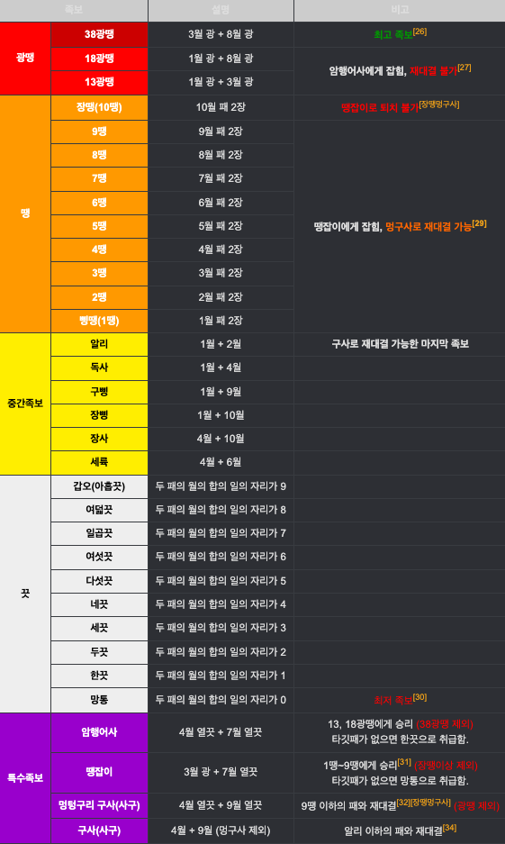

# 섯다 게임

화투로 할 수 있는 대표적인 카드 게임이다.

## 규칙

- [자세한 규칙](https://namu.wiki/w/%EC%84%B0%EB%8B%A4)
- 베팅 라운드는 최대 2라운드를 한다.
- 참가자와 1:1 방식으로 진행한다.
- 1월 ~ 10월까지 패만 필요하며 족보는 아래와 같다.
- 기본 카드 덱이 20장 존재한다.
- 게이머는 카드를 두장 가질 수 있다.
- 게이머는 자신의 패를 가지고 족보를 생성할 수 있다.
- 심판은 족보를 기반으로 게임의 승,패를 정할 수 있다.
- 족보는 광땡, 땡, 중간족보, 특수족보, 끗을 결정할 수 있다.

